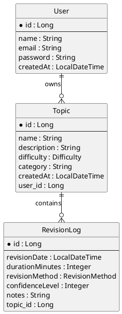
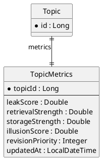
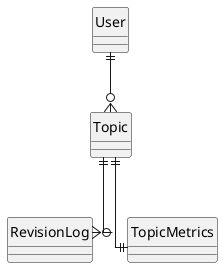

# RecallRadar - ER Diagram

## Purpose

This document defines the database relationships for RecallRadar.

It serves as the source of truth for:

* PostgreSQL schema design
* JPA entity relationships
* API design
* Future analytics features

---

# MVP Database Model

## User → Topic

### Business Rule

* One User can own many Topics.
* A Topic belongs to exactly one User.

### Cardinality

```text
User (1) ---- (N) Topic
```

---

## Topic → RevisionLog

### Business Rule

* One Topic can have many Revision Logs.
* A Revision Log belongs to exactly one Topic.

### Cardinality

```text
Topic (1) ---- (N) RevisionLog
```

---

# MVP ER Diagram



---

# Future Analytics Model

The following entity is intentionally excluded from MVP.

TopicMetrics contains derived values calculated from Topic and RevisionLog data.

Examples:

* Leak Score
* Retrieval Strength
* Storage Strength
* Revision Priority
* Illusion Score

---

## Topic → TopicMetrics

### Business Rule

* One Topic has exactly one metrics record.
* One metrics record belongs to exactly one Topic.

### Cardinality

```text
Topic (1) ---- (1) TopicMetrics
```

---

# Future ER Diagram



---

# Complete Future Architecture



---

# Relationship Summary

| Parent Entity | Child Entity | Relationship        |
| ------------- | ------------ | ------------------- |
| User          | Topic        | One-to-Many         |
| Topic         | RevisionLog  | One-to-Many         |
| Topic         | TopicMetrics | One-to-One (Future) |

---

# JPA Mapping Preview

These relationships will eventually be implemented using:

```java
User
    @OneToMany
    List<Topic>

Topic
    @ManyToOne
    User

Topic
    @OneToMany
    List<RevisionLog>

RevisionLog
    @ManyToOne
    Topic

Topic
    @OneToOne
    TopicMetrics
```

The exact implementation details will be defined during the persistence layer design phase.
