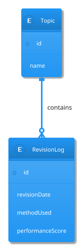

# Revision Log Design

## Purpose

RevisionLog is the foundational event entity of RecallRadar.

Every revision session performed by a learner generates a RevisionLog record.

Unlike a simple study tracker, RecallRadar stores not only the existence of a revision event but also information about:

* revision quality
* revision method
* learner confidence
* performance outcome

This enables future calculation of:

* Leak Score
* Retrieval Strength
* Storage Strength
* Confidence Accuracy
* Illusion Score
* Method Effectiveness

---

# Research Foundation

This design is informed by:

* [REF-02] Retrieval Strength & Storage Strength
* [REF-03] Practice Testing
* [REF-06] Confidence Calibration

Key findings:

1. Learning quality matters more than study frequency alone.
2. Retrieval practice outperforms passive review.
3. Confidence is often poorly calibrated.
4. Revision outcomes should be measured, not merely recorded.

---

# Entity Definition

```java
RevisionLog

id

topicId

revisionDate

methodUsed

durationMinutes

confidenceBefore

confidenceAfter

performanceScore

revisionStatus

notes
```

---

# Field Definitions

## id

Unique revision identifier.

Purpose:

Track individual revision sessions.

---

## topicId

Associated topic.

Relationship:

```text
Topic (1)
    ↓
RevisionLog (N)
```

A topic can have many revision sessions.

---

## revisionDate

Timestamp when revision occurred.

Purpose:

* Retention calculations
* Leak score calculations
* Revision history

---

## methodUsed

Revision technique used.

Supported Values:

```java
enum RevisionMethod {

    READING,

    ACTIVE_RECALL,

    QUIZ,

    PROBLEM_SOLVING,

    TEACHING,

    FLASHCARDS

}
```

Research Basis:

* [REF-02]
* [REF-03]

---

## durationMinutes

Time spent revising.

Purpose:

Future analytics.

Examples:

```text
10 minutes
30 minutes
60 minutes
```

---

## confidenceBefore

Learner confidence before revision.

Range:

```text
0 - 100
```

Example:

```text
90
```

Meaning:

"I believe I know this topic very well."

Research Basis:

* [REF-06]

---

## confidenceAfter

Learner confidence after revision.

Range:

```text
0 - 100
```

Purpose:

Compare confidence changes.

Future use:

Confidence calibration analysis.

---

## performanceScore

Objective outcome measurement.

Range:

```text
0 - 100
```

Examples:

```text
Quiz Score

Recall Accuracy

Practice Performance
```

Research Basis:

* [REF-03]

Purpose:

Measure actual retrieval quality.

---

## revisionStatus

Result of revision session.

```java
enum RevisionStatus {

    SUCCESS,

    PARTIAL_SUCCESS,

    FAILURE

}
```

Purpose:

Simplified interpretation layer.

---

## notes

Optional learner notes.

Examples:

```text
Forgot Spring Security filters.

Need more practice with JWT.
```

---

# Entity Relationships



---

# Lifecycle

```text
Topic Created
      ↓
User Revises Topic
      ↓
RevisionLog Created
      ↓
Metrics Recalculated
      ↓
Revision Queue Updated
```

---

# Future Analytics Usage

## Leak Score

Uses:

```text
revisionDate
performanceScore
```

---

## Retrieval Strength

Uses:

```text
performanceScore
revisionDate
```

---

## Storage Strength

Uses:

```text
methodUsed
performanceScore
revision history
```

---

## Illusion Score

Uses:

```text
confidenceBefore

vs

performanceScore
```

Example:

```text
Confidence = 90

Performance = 30
```

Potential illusion detected.

---

# Design Decisions

## Why Store Confidence?

Supported by:

* [REF-06]

Reason:

Confidence is not always correlated with actual recall.

---

## Why Store Performance?

Supported by:

* [REF-03]

Reason:

Successful retrieval is a stronger learning signal than mere exposure.

---

## Why Store Method?

Supported by:

* [REF-02]
* [REF-03]

Reason:

Different revision methods produce different learning outcomes.

---

# MVP Scope

Implemented:

✅ revisionDate

✅ methodUsed

✅ performanceScore

---

Deferred:

⏳ confidenceAfter

⏳ illusion analytics

⏳ method effectiveness analytics

⏳ retrieval strength calculations

---

# References

See:

```text
docs/research/REFERENCES.md

REF-02
REF-03
REF-06
```
