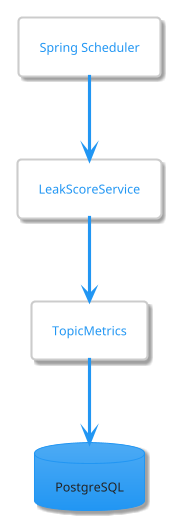
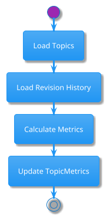
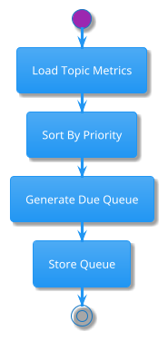
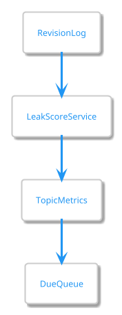

# Scheduler Design

## Purpose

The RecallRadar Scheduler is responsible for performing time-based background operations.

Unlike API requests, scheduler jobs execute automatically without direct user interaction.

The scheduler ensures that memory-related metrics remain accurate as time passes.

---

# Design Goals

The scheduler should:

- Recalculate forgetting risk
- Update topic metrics
- Maintain revision queues
- Detect overdue topics
- Prepare analytics data

The scheduler should NOT:

- Handle user requests
- Perform authentication
- Modify user-entered content

---

# Research Foundation

Supported by:

- [REF-01] Forgetting Curve
- [REF-04] Spaced Repetition Optimization

Key insight:

Memory changes even when users do nothing.

Therefore RecallRadar must periodically reevaluate retention status.

---

# Scheduler Architecture



---

# Scheduler Jobs

## Job 1 - Metric Recalculation

### Purpose

Update TopicMetrics based on current revision history.

### Frequency

```text
Daily
```

Recommended Time:

```text
02:00 AM
```

---

### Workflow



---

### Outputs

Updates:

```text
Leak Score

Revision Priority

Future Metrics
```

---

# Job 2 - Due Topic Queue Generation

## Purpose

Generate the next revision queue.

---

### Workflow



---

### Output

```text
Topics Due For Review
```

---

# Job 3 - Overdue Topic Detection

## Purpose

Detect topics that have exceeded acceptable review intervals.

---

### Example

```text
Recommended Review

7 Days

Actual Gap

21 Days
```

Result:

```text
Overdue
```

---

### Future Usage

May trigger:

```text
Notifications

Email Alerts

Dashboard Warnings
```

---

# Metric Recalculation Triggers

Metrics should be recalculated through three mechanisms.

---

## Trigger 1

### Revision Submitted

Immediately recalculate affected topic.

```text
Revision Saved
      ↓
Metrics Recalculated
```

---

## Trigger 2

### Nightly Scheduler

Recalculate all topics.

```text
Nightly
      ↓
Full Refresh
```

---

## Trigger 3

### Dashboard Refresh

Optional.

Only used if stale metrics are detected.

---

# Job Dependency Diagram



---

# MVP Scope

## Implemented

✅ Nightly Metric Recalculation

✅ Recalculate After Revision Submission

✅ Due Topic Queue Generation

---

## Deferred

⏳ Email Notifications

⏳ Mobile Notifications

⏳ Adaptive Scheduling

⏳ Personalized Review Intervals

⏳ Machine Learning Optimization

---

# Spring Implementation Strategy

Future implementation will use:

```java
@EnableScheduling
```

and

```java
@Scheduled
```

Example:

```java
@Scheduled(cron = "0 0 2 * * *")
public void recalculateMetrics() {

}
```

Meaning:

```text
Every Day
2:00 AM
```

---

# Scalability Considerations

MVP Assumption:

```text
Thousands Of Topics
```

Nightly recalculation is acceptable.

---

Future Assumption:

```text
Millions Of Topics
```

Would require:

- Job Queues
- Distributed Workers
- Incremental Processing

---

# Design Decisions

## Why Recalculate Nightly?

Supported By:

- [REF-01]
- [REF-04]

Reason:

Memory decay continues even when users do not interact with the system.

---

## Why Recalculate Immediately After Revision?

Reason:

Users expect updated analytics immediately after studying.

---

## Why Store Metrics?

Reason:

Avoid expensive recalculation on every request.

---

# References

See:

```text
docs/research/REFERENCES.md

REF-01
REF-04
```
