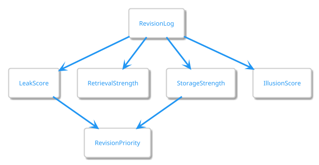
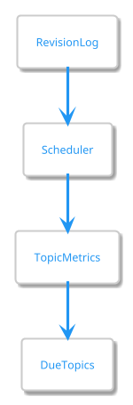

# Scoring Systems Design

## Purpose

This document defines the scoring systems used by RecallRadar.

These scores transform revision history into actionable learning insights.

The goals are:

- Estimate forgetting risk

- Prioritize revisions

- Identify weak topics

- Support future analytics

---

# Design Philosophy

Research provides evidence for:

- forgetting

- retrieval strength

- storage strength

- confidence calibration

Research does NOT directly define:

- Leak Score

- Revision Priority

These are RecallRadar-specific metrics inspired by research findings.

---

# Metric Architecture



---

# Leak Score

## Purpose

Estimate probability that a topic is being forgotten.

Supported By:

- [REF-01]

- [REF-02]

- [REF-04]

---

## Meaning

```text
0
=
No Forgetting Risk

100
=
Extreme Forgetting Risk
```

---

## Inputs

### Required

```text
Days Since Last Revision

Topic Difficulty

Revision Count
```

---

### Future Inputs

```text
Retrieval Strength

Storage Strength

Revision Quality
```

---

## MVP Formula

### RecallRadar Heuristic v1

```text
BaseRisk

=
DaysSinceRevision
× DifficultyWeight

LeakScore

=
BaseRisk
-
RevisionBonus
```

---

## Difficulty Weights

```text
EASY   = 1.0

MEDIUM = 1.5

HARD   = 2.0
```

Important:

These are implementation constants.

They are not research-derived values.

They may change based on user data.

---

## Range Interpretation

```text
0 - 25
Low Risk

26 - 50
Moderate Risk

51 - 75
High Risk

76 - 100
Critical Risk
```

---

# Retrieval Strength

## Purpose

Estimate current accessibility of memory.

Supported By:

- [REF-02]

---

## Meaning

```text
0
=
Cannot Recall

100
=
Immediate Recall
```

---

## Expected Behavior

```text
Successful Retrieval
        ↓
Increase

Time Passes
        ↓
Decrease
```

---

## Inputs

```text
Recent Performance Scores

Recent Success Rate

Days Since Revision
```

---

## Status

Future Phase

---

# Storage Strength

## Purpose

Estimate durability of learning.

Supported By:

- [REF-02]

---

## Meaning

```text
0
=
Weak Learning

100
=
Strong Learning
```

---

## Inputs

```text
Revision Count

Revision Method

Revision Quality

Spacing Quality
```

---

## Method Influence

```text
Reading
     +
     Small Increase

Active Recall
     +
     Medium Increase

Quiz
     +
     Medium Increase

Teaching
     +
     Large Increase
```

---

## Status

Future Phase

---

# Illusion Score

## Purpose

Estimate overconfidence.

Supported By:

- [REF-06]

---

## Meaning

```text
0
=
Accurate Self Assessment

100
=
Severe Overconfidence
```

---

## Core Principle

```text
Confidence
-
Performance
=
Calibration Gap
```

---

## Example

```text
Confidence = 90

Performance = 20
```

Result:

```text
High Illusion Score
```

---

## Inputs

```text
Confidence Before

Performance Score

Revision History
```

---

## Status

Future Phase

---

# Revision Priority

## Purpose

Determine review order.

Important:

```text
Revision Priority
≠
Leak Score
```

Leak Score measures forgetting.

Revision Priority determines action.

---

## Inputs

### MVP

```text
Leak Score

Difficulty
```

---

### Future

```text
Leak Score

Difficulty

Failure History

Storage Strength

Illusion Score
```

---

## Priority Levels

```text
Priority 1
Urgent

Priority 2
High

Priority 3
Medium

Priority 4
Low
```

---

# Scheduler Interaction



---

# Research vs Product Decisions

## Research Supported

- Forgetting increases over time

- Retrieval practice improves retention

- Confidence may be inaccurate

- Difficult retrieval improves learning

Supported By:

```text
REF-01
REF-02
REF-03
REF-06
```

---

## RecallRadar Decisions

- Leak Score

- Revision Priority

- Metric ranges

- Dashboard analytics

These are engineering decisions inspired by research.

---

# MVP Scope

Implemented

✅ Leak Score

✅ Revision Priority

---

Deferred

⏳ Retrieval Strength

⏳ Storage Strength

⏳ Illusion Score

⏳ Confidence Accuracy

⏳ Method Effectiveness

---

# References

See:

```text
docs/research/REFERENCES.md

REF-01
REF-02
REF-03
REF-04
REF-06
```
