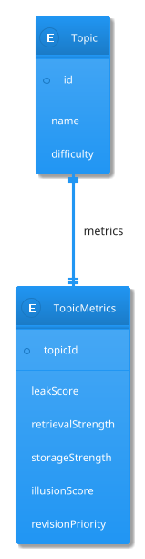
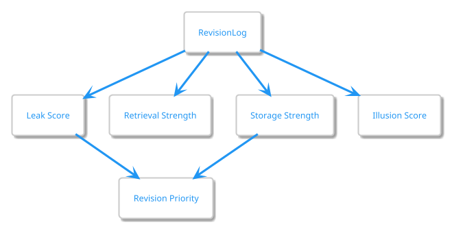
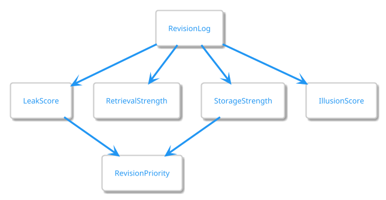

# Topic Metrics Design

## Purpose

TopicMetrics stores system-generated analytics for a topic.

Unlike Topic, which stores user-entered information, TopicMetrics stores derived information calculated from revision history and retention models.

TopicMetrics acts as the intelligence layer of RecallRadar.

---

# Research Foundation

This design is informed by:

- [REF-01] Forgetting Curve
- [REF-02] Retrieval Strength & Storage Strength
- [REF-04] Spaced Repetition Optimization
- [REF-06] Confidence Calibration

Research provides the underlying concepts.

RecallRadar provides the implementation-specific metrics.

---

# Entity Definition

```java
TopicMetrics

topicId

leakScore

retrievalStrength

storageStrength

illusionScore

revisionPriority

lastCalculatedAt
```

---

# Architecture Principle

```text
Topic
=
User Data

TopicMetrics
=
System Intelligence
```

---

# Entity Relationship



---

# Metric Overview



---

# Leak Score

## Purpose

Estimate probability of forgetting.

Supported By:

- [REF-01]
- [REF-04]

---

## Interpretation

```text
0     = Fully Retained

100   = High Forgetting Risk
```

---

## Inputs

```text
Days Since Last Revision

Difficulty

Revision Quality

Storage Strength

Retrieval Strength
```

---

## MVP Status

✅ Implemented

---

# Retrieval Strength

## Purpose

Estimate how accessible the memory is right now.

Supported By:

- [REF-02]

---

## Interpretation

```text
0 = Cannot Recall

100 = Immediate Recall
```

---

## Inputs

```text
Recent Revision Success

Recent Performance Scores

Time Since Revision
```

---

## Behavior

```text
Successful Recall
      ↓
Increase

Time Passes
      ↓
Decrease
```

---

## MVP Status

⏳ Future Phase

---

# Storage Strength

## Purpose

Estimate long-term learning durability.

Supported By:

- [REF-02]

---

## Interpretation

```text
0 = Weakly Learned

100 = Strongly Learned
```

---

## Inputs

```text
Revision Count

Revision Method

Performance Quality

Revision Spacing
```

---

## Behavior

```text
Reading
    ↓
Small Increase

Active Recall
    ↓
Larger Increase

Teaching
    ↓
Larger Increase
```

---

## MVP Status

⏳ Future Phase

---

# Illusion Score

## Purpose

Estimate mismatch between confidence and actual knowledge.

Supported By:

- [REF-06]

---

## Interpretation

```text
0 = Well Calibrated

100 = Severely Overconfident
```

---

## Inputs

```text
Confidence Before

Performance Score

Revision History
```

---

## Example

```text
Confidence = 90

Performance = 20
```

Result:

```text
High Illusion Score
```

---

## MVP Status

⏳ Future Phase

---

# Revision Priority

## Purpose

Determine review order.

Important:

```text
Revision Priority
≠
Leak Score
```

Supported By:

- [REF-04]

---

## Inputs

```text
Leak Score

Difficulty

Failure History

Storage Strength
```

---

## Interpretation

```text
Priority 1
Urgent

Priority 2
High

Priority 3
Medium

Priority 4
Low
```

---

# Calculation Flow



---

# Recalculation Strategy

Metrics are recalculated:

## Immediate

```text
After Revision Submission
```

---

## Scheduled

```text
Nightly Scheduler
```

---

## Optional

```text
Dashboard Refresh
```

---

# MVP Scope

Implemented:

✅ Leak Score

✅ Revision Priority

---

Deferred:

⏳ Retrieval Strength

⏳ Storage Strength

⏳ Illusion Score

---

# Design Decisions

## Why Separate Metrics From Topic?

Reason:

```text
Topic
=
User Data

Metrics
=
Derived Data
```

This keeps responsibilities separated.

---

## Why Store Metrics?

Reason:

Avoid recalculating expensive analytics on every request.

---

# References

See:

```text
docs/research/REFERENCES.md

REF-01
REF-02
REF-04
REF-06
```
